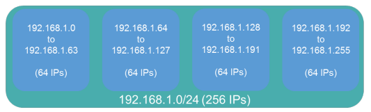

## IP Addressing

### IPv4 Addressing
* Classes of IPs, subnetting is network bits then host bits
| Class | 1st Octet Value | Default Subnet Mask | CIDR Notation | Possible Hosts |
| :-: | :-: | :-: | :-: | :-: |
| A | 1-127 | 255.0.0.0 | /8 | 16.7 million |
| B | 128-191 | 255.255.0.0 | /16 | 65,536 |
| C | 192-223 | 255.255.255.0 | /24 | 256 |
| D | 224-239 | n/a | n/a | n/a |
| E | 240-255 | n/a | n/a | 268 million (reserved)|

* **Multicast Address**: identifier for a group of hosts in a network
* **Classful Mask**: using default subnet mask for address class
* **Subnetting**: use classless subnet mask to create smaller networks with fewer hosts
* **Public IP (Routable)**: can be accessed over the internet, assigned by ISP
* **Private IP (Non-Routable)**: can be used by anyone anywhere in a LAN
| Address Class | Address Range Start | Address Range End | Default Subnet Mask |
| :-: | :-: | :-: | :-: |
| Class A | 10.0.0.0 | 10.255.255.255 | 255.0.0.0 |
| Class B | 172.16.0.0 | 172.31.255.255 | 255.255.0.0 |
| Class C | 192.168.0.0 | 192.168.255.255 | 255.255.255.0 |
* **Specialised IPs**:
    * Loopback/Localhost Address (127.0.0.1) - send data to the host itself, used to test network protocols and troubleshoot
    * Automatic Private IP Addresses (APIPA) - used when a device does not have a static IP or can't reach DHCP server. Ranges from 169.254.0.0 to 169.254.255.255
* **Virtual IP Address (VIP)**: IP address that does link to a NIC, used for NAT, fault-tolerance, virtualisation
* **Subinterfaces**: virtual interface created by dividing up a physical interface

### Data Flows
* **Unicast**: data goes from single device to single device (single)
* **Multicast**: data goes from single device to multiple devices (group)
* **Broadcast**: data goes from single device to all devices on a network (everyone)

### Assigning IP Addresses
* **Static**: manually type in IP, subnet mask, default gateway, DNS server (or WINS - uses NetBIOS to IP address)
* **Dynamic**: dynamically allocate IP addresses, DHCP server does everything automatically
    * Bootstrap Protocol (BOOTP)
    * Dynamic Host Control Protocol - assign IPs based on range of addresses (scope), allows to lease IPs (IPs given expiry date)
    * Automatic Private IP Addressing (APIPA) - used when device doesn't have static IP or cannot reach DHCP server, self assign without DHCP server on LAN, 169.254.0.0/16
    * ZeroConf - updated APIPA, assign IPv4 link-local addresses, resolve computer names to IPs, performs self discovery on network

### Subnetting
* **Subnetting**: split a large network into smaller networks, improves efficiency, security, bandwidth control
* **Number of Subnets**: **2^s**, s is the number of borrowed bits, 192.168.1.0/26, default is /24, 2^2 = 4 subnets

    

* **Number of Assignable hosts**: **2^h - 2**, h is host bits, 2 IPs are needed Network ID (first IP in range, name of network) and Broadcast ID (last IP in range)

### IPv6 Addressing
* **IPv6**:
    * Larger address space 4.2 billion (IPv4) vs 340 undecillion (IPv6)
    * No broadcasts
    * No packet fragmentation
    * Can coexist with IPv4 - dual stack, tunneling (IPv6 traffic in IPv4)
    * Smaller/Simplified header compared to IPv4
* **Example**:
    * 2018:0000:0000:0000:0000:0000:4815:54ae
    * 2018:0:0:0:0:0:4815:54ae
    * 2018::4815:54ae - can only do '::' once
* Address Types:
    * Unicast - intensify single interface 
        * Globally routable - public, begins with 2000 to 3999
        * Link-local - private, begins with FE80, uses SLAAC for stateless address autoconfiguration
    * Multicast - identify set of interfaces and broadcast to all devices in set, begins with FF
    * Anycast - identify set of interfaces for a packet to be sent to any member
* Neighbour Discovery Protocol (NDP): learns L2 addresses on network, router and solicits/advertises, can redirect traffic for the best first hop router