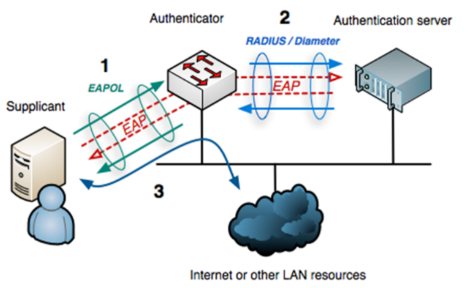

# Wireless Networks

## Wireless Networking (WLAN)
* 802.11 is the Wifi standard
* **Ad-Hoc mode**: device to device communication, like peer-to-peer
* **Infrastructure mode**: communicate through central access point or router
* **Wireless Access Point (AP/WAP)**: wired LAN to wireless on the same subnet, all clients on single collision domain
* **Wireless Router**: gateway device - combines AP, router, switch, firewall, fibre/cable/DSL modems into one box

## WLAN Service Sets
<table>
    <tr>
        <th>Independent Service Set</th>
        <th>Basic Service Set</th>
        <th>Extended Service Set</th>
    </tr>
    <tr style="background-color: #fff">
        <td style="padding: 0"></td>
        <td style="padding: 0"></td>
        <td style="padding: 0"></td>
    </tr>
</table>

* **Mesh Topology**: use a combination of different wireless networks - Wi-Fi, microwave, cellular, etc

* **AP Placement**:
<table>
    <tr>
        <th style="text-align: center">2.4 Ghz</th>
        <th style="text-align: center">5 Ghz</th>
    </tr>
    <tr style="background-color: #fff">
        <td style="padding: 0;width: 50%"></td>
        <td style="padding: 0;width: 50%"></td>
    </tr>
</table>

* **Site Surveys**: produce a heatmap to show coverage from APs
* **Wireless Range Extenders**: device that amplifies coverage, one antenna receives and the other repeats

## Wireless Antennas
* **Omnidirectional**: transmit in all directions - fixed or inside
* **Unidirectional**: transmit in a single direction, can choose direction - on roof of a building

## Wireless Frequencies

### Spread Spectrum Wireless Transmissions
* **Direct-Sequence Spread Spectrum (DSSS)**
* **Frequency-Hopping Spread Spectrum (FHSS)**
* **Orthogonal Frequency-Division Multiplexing (OFDM)**

### Frequencies and Channels
* **Channel**: virtual medium where wireless networks can send/receive data - virtual pipes
* Channels 1, 6, 11 avoid overlapping in 2.4 GHz band
* Channel size for 2.4/5 GHz bands is 20 MHz
* **Channel Bonding**: merge neighbouring channels into one channel
* **Radio Frequency Interference (RFI)**: interference is caused by - overlapping channels, microwaves, security cameras, physical obstacles, signal strength

### 802.11 Wireless Standards
* **Multiple Input and Multiple Output (MIMO)**: use more antennas for higher bandwidth
* **Multiple User MIMO (MU-MIMO)**: allow multiple users to use the wireless network and AP

| Standard | Band | Bandwidth |
| :-: | :-: | :-: |
| 802.11a | 5 GHz | 54 Mbps |
| 802.11b | 2.4 GHz | 11 Mbps |
| 802.11g | 2.4 GHz | 54 Mbps |
| 802.11n (Wifi 4) | 2.4/5 GHz | 150 Mbps 600 Mbps (MIMO) |
| 802.11ac (Wifi 5)| 5 GHz | 3 Gbps (MU-MIMO)|
| 802.11ax (Wifi 6) | 2.4/5/6 GHz | 9.6 Gbps (MU-MIMO) |

### Carrier Sense Multiple Access/Collision
* Ethernet uses CSMA/CD, WLAN uses CSMA/CA
* Listens for transmission to determine if safe to transmit
    * If clear, transmit Request to Send (RTS)
    * Device waits for acknowledgement
    * If RTS received then send Clear to Send (CTS)

## Wireless Security

| Standard | Security |
| --- | --- |
| Open | No security/protection |
| WEP | IV |
| WPA | TKIP and RC4 |
| WPA2 | CCMP and AES |

* **Pre-Shared Key**: AP and client use same encryption key
* **Wired Equivalent Privacy (WEP)**: claimed to be as secure as wired networks, 24-bit Initialisation Vector (IV) sent in cleartext, encryption key is 64/128 bit
* **Wifi Protected Access (WPA)**: replacement to WEP
    * Temporal Key Integrity Protocol (TKIP) - 48 bit IV, RC4 encryption used
    * Message Integrity Check (MIC) - confirms data was not modified during transit (MITM attack)
    * Enterprise Mode - users auth before sending keys, keys are temporary
* **WPA2**: stronger encryption, integrity checking through CCMP
    * Uses Advanced Encryption Standard (AES) - 128 bit or more
    * Modes - Personal (pre-shared keys), enterprise (auth required)
* **Extensible Authentication Protocol (EAP)**: auth performed using 802.1x (users auth with own creds)

    

* **MAC Address Filtering**: configures AP with permitted MAC addresses, though can easily change MAC address
* **Network Access Control (NAC)**: permit/deny access to network by device's characteristics (OS, antivirus)
* **Captive Portal**: webpage before a user can get access to network - airport wifi
* **Geofencing**: use GPS/RFID to create real-world boundaries - to auth, must be in location
* **Disabling SSID Broadcast**: make AP not broadcast name of WLAN, though still can be sniffed
* **Rogue Access Point**: fake AP set up to capture all packets going through it (MITM)
* **Unsecured Wireless Networks**:
    * War driving - users look for unsecured wireless networks
    * War chalking - users write symbols on a wall to notify others of AP characteristics