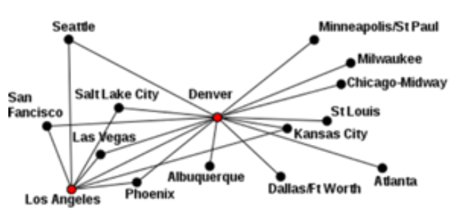

# Network Basics

## Network componenents
* **Client** - end user device to access network
* **Server** - provides resources to network
* **Hub** - receives info from one port, sends that info to all other ports
* **Wireless Access Point (WAP)**: connect to wired network wirelessly
* **Switch** - forwards info from src to dest ports
* **Router** - connects networks together, forward traffic with IP addresses
* **Media** - connects devices together or connects device to a switch port
* **WAN Link**: connect different geological regions together

## Network Resources
* **Client/Server Model**: dedicated server to provide access to files, scanners/printers, etc
* **Peer-to-Peer (P2P) Model**: files and printers are shared directly to others

## Network Geography
* **Personal Area Network (PAN)**: smallest wired/wireless network - bluetooth and USB
* **Local Area Network (LAN)**: devices locally connected in a room/building - ethernet and wifi
* **Campus Area Network (CAN)**: connects LANs across multiple buildings/floors
* **Metropolitan Area Network (MAN)**: connects locations in a city/town
* **Wide Area Network (WAN)**: connects locations in country/worldwide, not all WANs are public

## Network Topologies

### Wired
<table>
    <tr>
        <th>Bus</th>
        <th>Ring</th>
        <th>Star</th>
        <th>Hub and Spoke</th>
        <th>Full Mesh</th>
        <th>Partial Mesh</th>
    </tr>
    <tr style="background-color: #fff">
        <td style="padding: 0"></td>
        <td style="padding: 0"></td>
        <td style="padding: 0"></td>
        <td style="padding: 0"></td>
        <td style="padding: 0"></td>
        <td style="padding: 0"></td>
    </tr>
</table>

### Wireless
* **Infrastructure Mode**: use wireless access point as a centralised point, has wireless security
* **Ad-hoc Mode**: connect device to device dynamically, uses a p2p network to communicate
* **Wireless Mesh**: combine  wireless technologies (wifi, microwave, satelite, radio) to create a mesh network

## Internet of Things (IoT)
* **802.11**: wireless networking in infrastrucutre/ad-hoc mode
* **Bluetooth**: low-energy version of bluetooth, lose keys - bluetooth to phone to cellular
* **Radio-frequency Identification (RFID)**: embedded chip with electro-magnetic fields to read tag
* **Near-field Communication (NFC)**: 4cm range communication - apple-pay
* **Infrared (IR)**: line of sight communication with infrared frequencies
* **Z-Wave**: short-range and low-latency but slow-rates and less power consumption than wifi - home automation
* **ANT+**: collection and transfer of sensory data (car tyre pressure, lights on/off, etc)