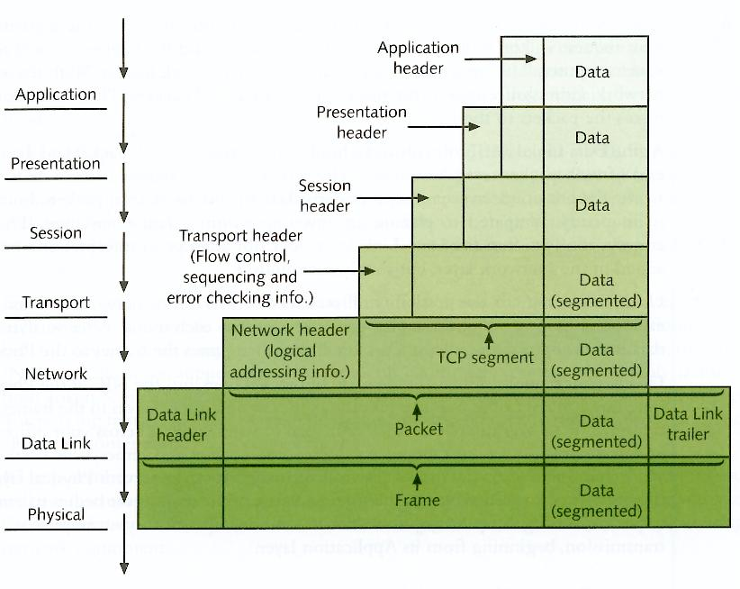
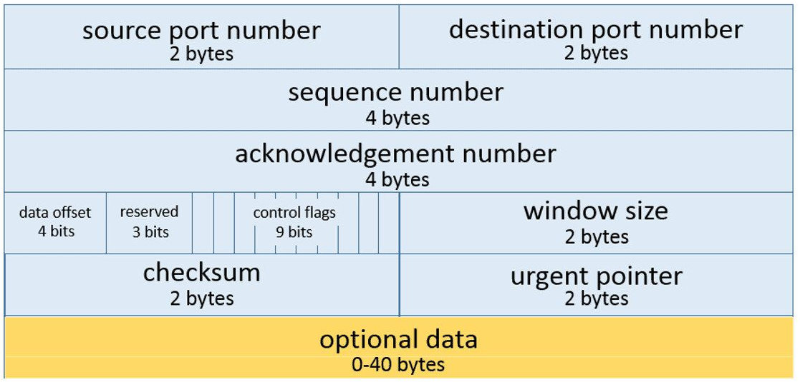
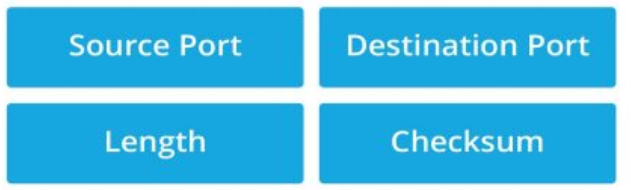
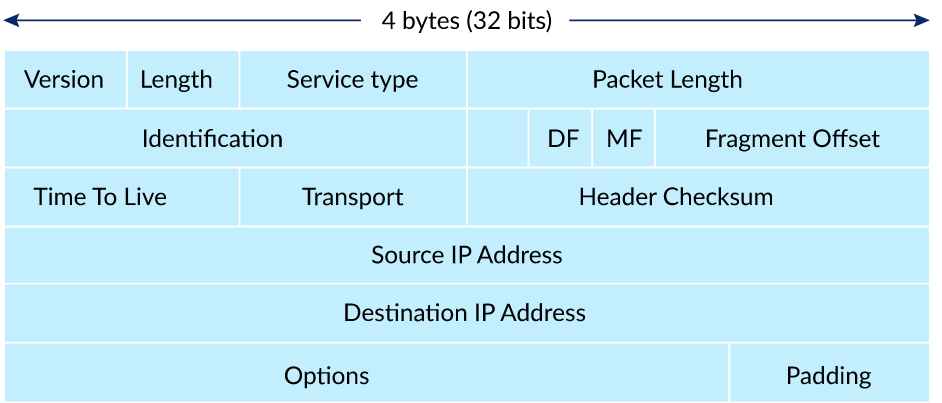
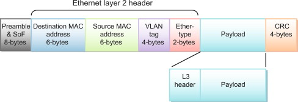

# OSI Model
<u>**A**</u>ll
<u>**P**</u>eople
<u>**S**</u>eem
<u>**T**</u>o
<u>**N**</u>eed
<u>**D**</u>ata
<u>**P**</u>rocessing

## L1 - Physical (Bits)
* **Media** - cables (fibre optic, ethernet, coaxial), radio (bluetooth, wifi, nfc)
* **Devices** - hubs, access points, media converters
* **Asynchronous**: start and stop bits sent from sender to receiver
* **Synchronous**: take turns using a reference clock from sender and receiver
* **Bandwidth**:
    * Broadband - divide into separate channels, like tv channels
    * Baseband - use all frequencies on the cable all the time, like a phone call

#### Multiplexing (all for baseband) - TDM, StatTDM, FDM
* **Time-Division Multiplexing**: take turns using allocated time slots
* **Statistical TDM**: dynamically allocate time slots to devices who need bandwitdth
* **Frequency-Division Multiplexing**: split into channels like broadband, each person gets an amount of portions

## L2 - Data Link (Frames)
* **Media Access Control**: physically identify device, first half is vendor code, second half is unique value
* **Logical Link Control (LLC)**: flow control (limit messages if needed), error control (checksum), acknowledge receipt (received right message)
* **Isochronous**: agreed on reference clock, create time slots for transmission
* **Synchronous**: limited to agreed clock for frame start and end, use control characters
* **Asynchronous**: devices reference own clock cycles and own start and stop bits.
* **Devices**: NICs, switches, bridges

## L3 - Network (Packets)
* **Logical addressing**: ipv4 (172.16.254.1), ipv6 (fe80::7d25:7e1a:b79d:67e4 - 0's are omitted)
* **Switching (routing data)**:
    * Packet - data is divided into packets and forwarded based on IP address
    * Circuit - dedicated link between two devices, data is sent over a path of circuits to the destination
    * Message - data is divided into messages and are stored and forwarded, like email.
* **Route discovery and selection**: routers can route statically (use same path) or dynamically (figure out best path). Protocols used are RIP, OSPF, EIGRP
* **Connection services**: improve reliability L2 services - flow control (send more or send less), packet reordering (packets are numbered, if in wrong order then put them in right order)
* **Internet Control Message Protocol (ICMP)**: send messages and operational info to an IP dest - ping, tracert
* **Devices**: Routers, multi-level-switches (L2 switch and L3 router)

## L4 - Transport (TCP - Segments, UDP - Datagrams)
* **TCP** is more overhead but is reliable, **UDP** has less overhead but is unreliable

| TCP | UDP |
| --- | --- |
| Reliable | Unreliable |
| Connection-oriented | Connectionless |
| Windowing and segment retransmission | No windowing or retransmission |
| Segment sequencing | No sequencing |
| Acknowledges segments | No acknowledgement | 

* **Three-way-handshake**: TCP uses control flags SYN, SYN ACK, ACK

    

* **Windowing**: allows clients to adjust the amount of data in each segment, more retransmissions = decrease window, no retransmissions = increase window, this is used to get the maximum throughput of the network.

* **Buffering**: memory allocated on devices to store segments if bandwidth isn't available, 'clearing the buffer' is going through the stored segments in the buffer.

* **Devices**: WAN accelerators, load balancers and firewalls

## L5 - Session (Data)
* Keeps conversations separate to prevent intermingling of data from other sessions
* **Set up**: check user credentials, assign a unique number to session
* **Maintain**: transfer data, reestablish connection if lost, acknowledge receipt (acknowledge data was received)
* **Tear down**: end the session when transfer is done or when the other party disconnects
* **Examples**:
    * H.323 - set up, maintain, tear down voice/video connections using Real-time Transport Protocol (RTP)
    * NetBIOS - share files over the network

## L6 - Presentation (Data)
* **Data formatting**: data is formatted to have compatibility with different devices - ASCII (ensures readability, standardised formatting, syntax for L7), GIF, JPG, PNG, etc
* **Encryption**: encrypt data to stop eavesdroppers from seeing private information (usernames, passwords, credit card info) as it is transmitted - Transport Layer Security (TLS) or Secure Sockets Layer (SSL)
* **Examples**:
    * Scripting languages (for formating data, HTML, XML, PHP, JS)
    * Standard text (ASCII, Unicode, EBCDIC)
    * GIF, JPG TIF SVG PNG, etc
    * MPG, MOV, etc
    * Encryption algorithms (TLS, SSL)

## L7 - Application (Data)
* **Application Services**: combines communicating components from network applications, some include:
    * File transfer/Sharing
    * Email
    * Remote access
    * Network management activities
    * Client server processes
* **Service Advertisement**: applications announce to devices the services they offer, printers and file servers may register with Active Directory instead
* **Examples**:
    * Email applications (POP3, IMAP)
    * Web browsing (HTTP, HTTPS)
    * Domain Name Service (DNS)
    * File Transfer (FTP, FTPS, SFTP)
    * Remote access (TELNET, SSH, SNMP)

# Encapsulation and Decapsulation
* **Encapsulation**: putting headers (and sometimes trailers) around data, moving down layers
* **Decapsulation**: removing headers (and sometimes trailers) from data, moving up layers
* **Protocol Data Unit (PDU)**: a single unit of info transmitted in a network
* **Maximum Transmission Unit (MTU)**: size of the largest packet that is accepted, this is 1500 bytes

    

* **TCP header** (40-60 bytes):

    

* **TCP header control flags**:
    * SYN (Synchronisation) - sync connection during 3WH
    * ACK (Acknowledgement) - acknowledge successful reciept of the packets during 3WH
    * FIN (Finished) - tear down virtual connection created by 3WH and SYN flag
    * RST (Reset) - used when client/server receives an unexpected packet during connection
    * PSH (Push) - data is given high priority by sender
    * URG (Urgent) - like push but data is given high priority by receiver

* **UDP header** (8 bytes):

    

* **IP header** (20-24 bytes):

    

* **Ethernet header** (18 bytes):

    

