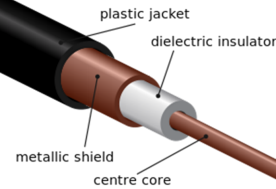
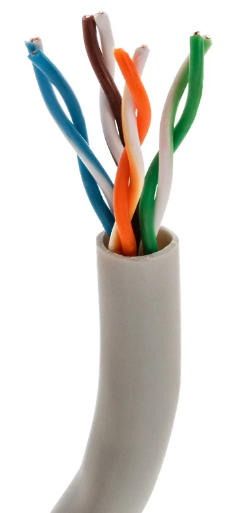
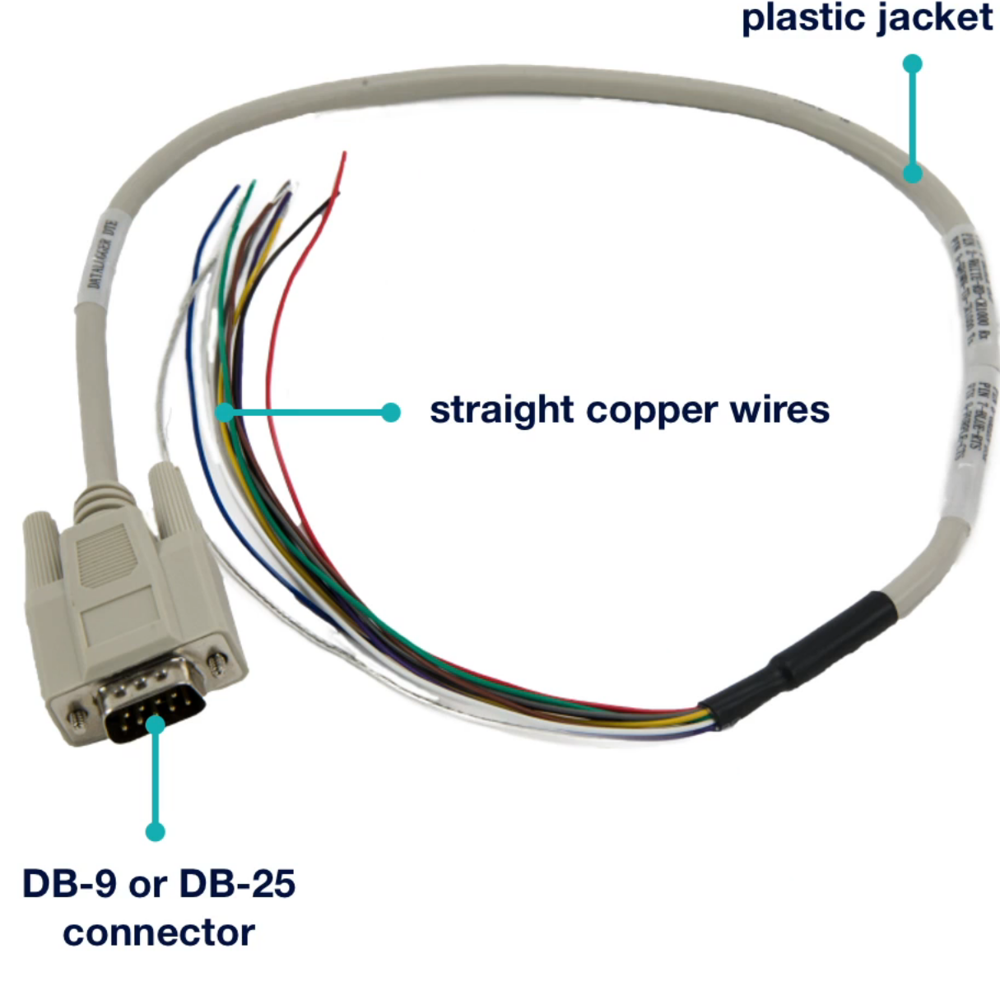
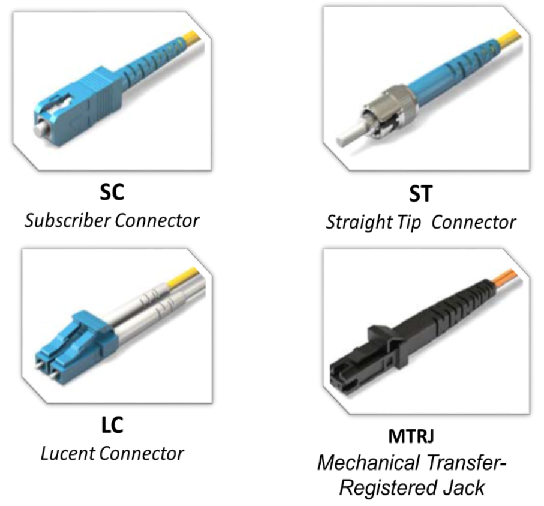
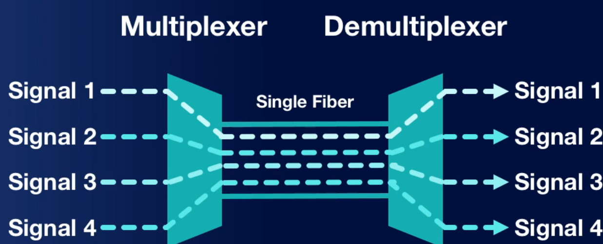

# Media and Cabling Distribution

* **Bandwidth**: how much data could be transferred from source to destination
* **Throughput**: how much data actually will be transferred from source to destination

## Copper Media

* A **straight-through cable** (or patch cable) contains the same pinouts on both ends.
* A **crossover cable** swaps send and receive pins on other end
* **Data Terminal Equipment (DTE)**: endpoint devices - laptops, desktops, servers, routers
* **Data Communications Equipment (DCE)**: switches, modems, hubs, bridges
* Straight-through for DTE-DCE and DCE-DTE
* Crossover for DTE-DTE and DCE-DCE (**switch to a switch** for non MDIX switches)

### Coaxial

    

* Found in RG-6 from TV from provider to premise, RG-59 from premise to wall connector
* **Connectors**: F-type (most common, TV), BNC connectors (legacy networks)

### Twinaxial
* Like coaxial but has two inner conductors for data instead of one

### Twisted Pair

    

* The more twisted cables are, the less EMI
* **UTP**: cheap, bends easily, used everywhere
* **STP**: minimise EMI and outside environment, costs more than UTP
* **Plenum Cable**: coating put on UTP/STP cables to be more fire-resistant and reduces dangerous fumes (ceilings, walls, raised floors, air ducts)
* **Connectors**: RJ45 (most common, 4/8 pins used, data networks), RJ11 (2/4 pins out of 6 used, phone networks)

| Category | Standard | Bandwidth | Distance |
| --- | --- | --- | --- |
| CAT 3 | 10BASE-T | 10 Mbps | 100m |
| CAT 5 | 100BASE-TX | 100 Mbps | 100m |
| CAT 5e | 1000BASE-T | 1000 Mbps | 100m |
| CAT 6 | 1000BASE-T 10GBASE-T | 1000 Mbps 10 Gbps | 100m 55m |
| CAT 6a | 10GBASE-T | 10 Gbps | 100m |
| CAT 7 | 10GBASE-T | 10 Gbps | 100m |
| CAT 8 | 40GBASE-T | 40 Gbps | 30m |

* Keep cables under 70m to ensure it will be under 100m

### Serial

    

* Not used much today but still used in ISDN modem, T1/E1 modem connection

## Fiber Media

* **Fibre optic cable**: uses LED/laser in a thin glass fibre, immune to EMI, 100s of meters, more range and bandwitdth than copper, but is expensive and harder to work with

### Multimode Fibre and Single-Mode Fibre
| MMF (blue/orange cables) | SMF (yellow cables) |
| --- | --- |
| Larger core size | Smaller core size |
| Covers shorter distances | Covers longer distances |
| Less expensive | More expensive |

### Fibre Optic Connectors

    

* **Angled Physical Contact (APC)**: angles up on connection - green
* **Ultra Physical Contact (UPC)**: goes straight through on connection - blue

### Wavelength Division Multiplexing

    

| | Coarse WDM | Dense WDM |
| --- | --- | --- |
| Wavelength channels | Up to 18 channels | Up to 80 channels |
| Channel Distance | 20nm | 0.8nm |
| Speed | Up to 10 Gbps (Ethernet) Up to 16 Gbps (Fibre) | Up to 8 Tbps (100Gbps/channel) |
| Used by | Home, businesses, offices | ISPs, backbones |

## Transceivers
* Fibre optic can go 40km+ and carry speeds of 60-70 Tbps+
* Copper cables can go up to 100m and carry speeds up to 10 Gbps
* **Media converter** or **Transceiver**: convert media from one format to another - ethernet to fibre optic, coaxial to fibre optic

### Transceivers
* **Bidirectional/half-duplex**: devices take turn sending/receiving
* **Full duplex**: devices can communicate at the same time

### Types
| Transceiver | Speed |
| --- | --- |
| GBIC | 1 Gbps |
| SFP | 4.2 Gbps |
| QSFP | 16 Gbps |
| QSFP+ | 41.2 Gbps |
| QSFP28 | 100 Gbps |
| QSFP56 | 200 Gbps |