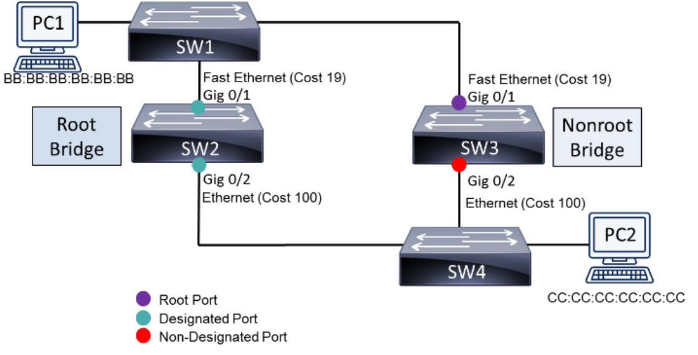

## Ethernet Fundamentals
* Ethernet uses contention-based (chaotic) network access
* **CSMA/CD**: devices listen and wait for turn to transmit, if two devices transmit at the same time then set a random backoff timer for both devices for them to transmit again.
* **Collision Domains**: all devices on a shared ethernet segment (on same cable/hub), all are suspectible to colliding with each other, putting devices on more collision domains = less collisions.
* **Ethernet standards**:
    * Copper - Cat 3, 5, 5e, 6, 7, 8 (all are up to 100m except for Cat 8 which is 30m)
    * Fibre - MMF (200-500m), SMF (40km)

### Infrastructure Devices
* **Hub**: repeats signals from a port to all other ports
    * Passive hub - repeat signal with no amplification
    * Active hub - repeats signal with amplication (reset CAT X length)
    * Smart hub - active hub with features like SNMP
* **Bridge**: analyses source MAC addresses, generates MAC address table and makes forwarding decisions based on destination MAC addresses
* **Switch**: connects network segments, each port is like a bridge, generates routing table from previous routes
* **Broadcast Domain**: collection of devices that have an ARP packet sent to them to figure out who's who
* **Router**: connects networks together, makes routing decisions, each port is a different collision/broadcast domain
* **L3 Swtich**: makes routing decisions and connects networks (router), not just network segments (like a L2 switch)

### Additional Ethernet Features - Switch features
refer to next sections for VLANs, Trunking, STP
* **Link aggregation**: combine physical connections into a single logical connection to minimise congestion
* **Power Over Ethernet (PoE)**: provides electrical power over ethernet to a device (CAT 5 or above, 15.4W/25.5W)
* **Port Monitoring/Mirroring**: copies all traffic for a port and sends it to another port
* **User Authentication**: require users to auth before getting access to network
* **Management Access and Authentication**: SSH (remote in), Console Port (plug laptop into switch), Out-of-band management (access from separate network)
* **First-Hop Redundancy**: Hot Standby router Protocol (HSRP) uses virtual IP and MAC address to provide active and standby routers.
* **MAC filtering**: permit/deny traffic (blacklist/whitelist) from a device by it's MAC address
* **Traffic filtering**: permit/deny traffic (blacklist/whitelist) from a device by it's IP address
* **Quality of Service**: forwards traffic based on priority
* **Spanning Tree Protocol (STP)**: prevents redundant links and traffic loops between switches

    

