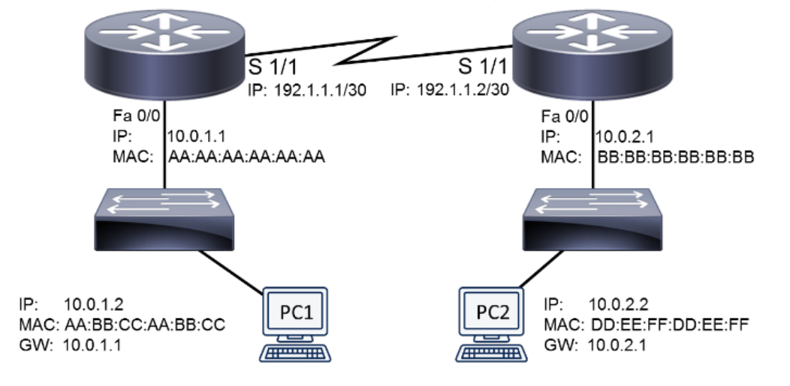
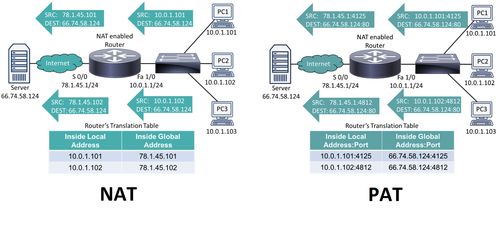

# Routing
* Forward traffic between subnets, between internal/external network, between two external networks

## Routing Fundamentals

    

* Packet from PC1 to PC2
    1. PC1 sends ARP request, receives ARP reply, forwards data frame to router's MAC address
    2. Router 1 receives data frame, looks at IP header, looks at routing table, decrements TTL, forwards data frame
    3. Router 2 receives data frame, decrements TTL, looks at IP header, sends ARP request, receives reply, forwards data frame to PC2

## Routing Tables
* Determine which path to take, uses ARP caches to map IP address to a MAC address
| Destination Network | Next Router | Port | Route Cost |
| :-: | --- | --- | --- |
| 125.0.0.0 | 137.3.14.2 | 1 | 12 |
| 161.5.0.0 | 137.3.6.6 | 1 | 4 |
| 134.7.0.0 | 134.17.3.12 | 2 | 10 |

### Routes
* **Directly connected**: learned by physical connection
* **Static**: manually configured, every router has a default static route (0.0.0.0/0 - if you don't know where to go, then go here)
* **Dynamic**: automatically learned by exchanging info between routers using dynamic routing protocols

### Preventing Routing Loops
* **Split horizon**: prevents learned route from being advertised out same interface
* **Poison reverse**: makes route from interface to be advertised back out with a extremely high cost

### Routing Protocols
* **Interior Gateway Protocol (IGP)**: operate within autonomous systems (intranet)
* **Exterior Gateway Protocol (EGP)**: operate between autonomous systems (internet)
* Router Advertisement Method:
    * Distance vector - copy of routing table sent to neighbours, all routers update on topology change (distance)
    * Link state - knows all paths other routers can reach (speed)
    * Hybrid
* **Route believability**: Directly Connected > Staticly Configured > EIGRP > OSPF > RIP > Ext EIGRP > Unknown

| Routing Protocol | Description | Type | IGP/EGP |
| :-: | :-: | :-: | :-: |
| Routing Information Protocol (RIP) | Uses hop count, max is 15, updates every 30 seconds, runs on UDP | Distance vector | IGP |
| Open Shortest Path First (OSPF) | Uses link speed as cost | Link state | IGP |
| Intermediate System-to-Intermediate System (IS-IS) | Functions like OSPF, link speed as cost | Link state | IGP |
| Enhanced Interior Gateway Routing Protocol (EIGRP) | Hybrid, uses bandwidth (speed) and delay (hops) | Advanced distance vector | IGP |
| Border Gateway Protocol (BGP) | Uses number of autonomous system hops (groups of routers), backbone of the internet, slow convergeance | Path vector | EGP |

## Address Translation
* **Network Address Translation (NAT)**: translates private IP to public IP
* Address Translation
    * Dynamic NAT (DNAT) - automatically assign IP from a shared pool, one-to-one translation (use and return)
    * Static NAT (SNAT) - manually assign private/public IPs, one-to-one translation
    * Port Address Translation (PAT) - sharing one public IP with multiple private IPs, many-to-one
* NAT IP Address Names
    * Inside local - private IP referencing inside device (10.0.1.101)
    * Inside global - public IP referencing inside device (10.0.1.1)
    * Outside local - private IP referencing outside device (78.1.45.1)
    * Outside global - public IP referencing outside device (66.74.58.124)

    

## Multicast Routing
* Multicast sender sends traffic to multicast group (Class D IP) - one packet = many devices receiving
* Protocols:
    * **Internet Group Management Protocol (IGMP)** - tell routers which interfaces have multicast receivers, allows clients to join multicast group
    * **Protocol Independent Multicast (PIM)** - routes multicast traffic between routerrs and forms a multicast distribnution tree
        * Dense Mode - flood and prune to form optimal distribution tree
        * Sparse Mode - uses shared distribution tree initially, finds best tree over time, switches once the best tree is found